Gerbolyze high-fidelity SVG/PNG/JPG to PCB converter
====================================================

Gerbolyze renders SVG vector and PNG/JPG raster images into existing gerber PCB manufacturing files. 
Vector data from SVG files is rendered losslessly *without* an intermediate rasterization/revectorization step.
Still, gerbolyze supports (almost) the full SVG 1.1 spec including complex, self-intersecting paths with holes,
patterns, dashes and transformations

Raster images can either be vectorized through contour tracing (like gerbolyze v1.0 did) or they can be embedded using
high-resolution grayscale emulation while (mostly) guaranteeing trace/space design rules.

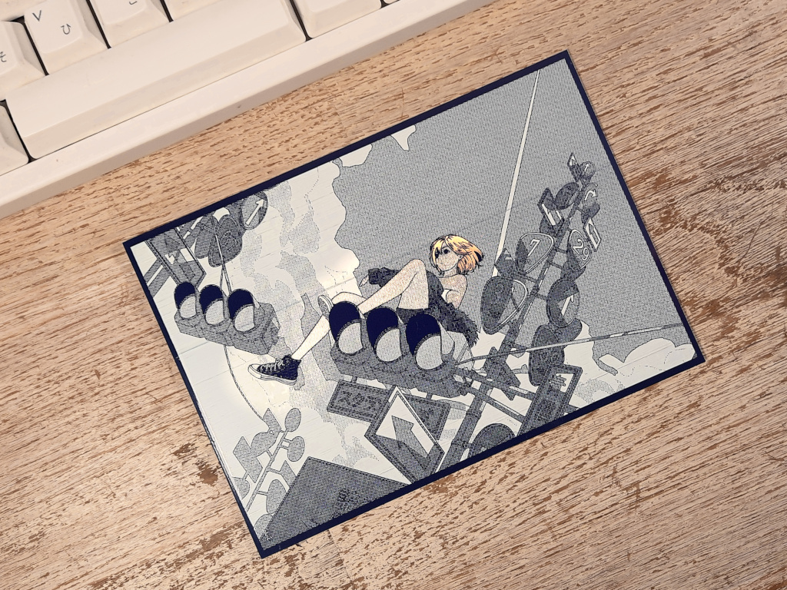

  Drawing by `トーコ Toko <https://twitter.com/fluffy2038/status/1317231121269104640>`__ converted using Gerbolyze and printed at PCBWay.

Tooling for PCB art is quite limited in both open source and closed source ecosystems. Something as simple as putting a
pretty picture on a PCB can be an extremely tedious task. Depending on the PCB tool used, various arcane incantations
may be necessary and even modestly complex images will slow down most PCB tools to a crawl.

Gerbolyze solves this problem in a toolchain-agnostic way by directly vectorizing SVG vector and PNG or JPG bitmap files
onto existing gerber layers. Gerbolyze processes any spec-compliant SVG and "gerbolyzes" SVG vector data into a Gerber
spec-compliant form. Gerbolyze has been tested against both the leading open-source KiCAD toolchain and the
industry-standard Altium Designer. Gerbolyze is written with performance in mind and will happily vectorize tens of
thousands of primitives, generating tens of megabytes of gerber code without crapping itself. With gerbolyze you can
finally be confident that your PCB fab's toolchain will fall over before yours does if you overdo it with the high-poly
anime silkscreen.

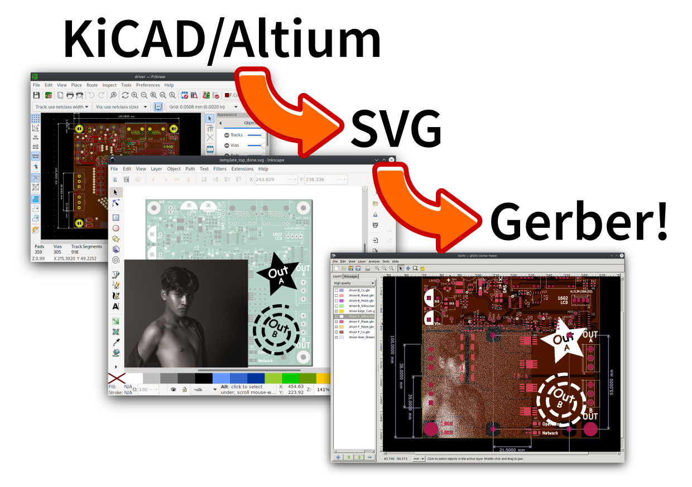

.. contents::

Tl;dr: Produce high-quality artistic PCBs in three easy steps!
--------------------------------------------------------------

Gerbolyze works in three steps.

1. Generate a scale-accurate template of the finished PCB from your CAD tool's gerber output:
   
   .. code::
        
       $ gerbolyze template --top template_top.svg [--bottom template_bottom.svg] my_gerber_dir

2. Load the resulting template image Inkscape_ or another SVG editing program. Put your artwork on the appropriate SVG
   layer. Dark colors become filled gerber primitives, bright colors become unfilled primitives. You can directly put
   raster images (PNG/JPG) into this SVG as well, just position and scale them like everything else. SVG clips work for
   images, too. Masks are not supported.

3. Vectorize the edited SVG template image drectly into the PCB's gerber files:

   .. code::

        $ gerbolyze paste --top template_top_edited.svg [--bottom ...] my_gerber_dir output_gerber_dir

Quick Start Installation
------------------------

This will install gerbolyze and svg-flatten into a Python virtualenv and install usvg into your ``~/.cargo``.

Note:
    Right now (2020-02-07), ``pcb-tools-extension`` must be installed manually from the fork at:

    ``pip3 install --user git+https://git.jaseg.de/pcb-tools-extension.git``

    This fork contains fixes for compatibility issues with KiCAD nightlies that are still in the process of being
    upstreamed.

Debian
~~~~~~

Note:
    Right now, debian stable ships with a rust that is so stable it can't even build half of usvg's dependencies. That's
    why we yolo-install our own rust here. Sorry about that. I guess it'll work with the packaged rust on sid.

.. code-block:: shell
    
    sudo apt install libopencv-dev libpugixml-dev libpangocairo-1.0-0 libpango1.0-dev libcairo2-dev clang make python3 git python3-wheel curl python3-pip python3-venv

    curl --proto '=https' --tlsv1.2 -sSf https://sh.rustup.rs | sh
    source $HOME/.cargo/env
    rustup install stable
    rustup default stable
    cargo install usvg

    pip3 install --user git+https://git.jaseg.de/pcb-tools-extension.git
    pip3 install --user gerbolyze --no-binary gerbolyze

Ubuntu
~~~~~~

.. code-block:: shell
    
    sudo apt install libopencv-dev libpugixml-dev libpangocairo-1.0-0 libpango1.0-dev libcairo2-dev clang make python3 git python3-wheel curl python3-pip python3-venv cargo
    cargo install usvg

    pip3 install --user git+https://git.jaseg.de/pcb-tools-extension.git
    pip3 install --user gerbolyze --no-binary gerbolyze

Fedora
~~~~~~

.. code-block:: shell
    
    sudo dnf install python3 make clang opencv-devel pugixml-devel pango-devel cairo-devel rust cargo
    cargo install usvg

    pip3 install --user git+https://git.jaseg.de/pcb-tools-extension.git
    pip3 install --user gerbolyze --no-binary gerbolyze
    
Arch
~~~~

.. code-block:: shell

    sudo pacman -S pugixml opencv pango cairo git python make clang rustup cargo pkgconf

    rustup install stable
    rustup default stable
    cargo install usvg

    pip3 install --user git+https://git.jaseg.de/pcb-tools-extension.git
    pip3 install --user gerbolyze --no-binary gerbolyze

macOS (via Homebrew)
~~~~~~~~~~~~~~~~~~~~

.. code-block:: shell

    # Tested on a fresh Mac OS 10.15.7 Catalina installation
    
    # Requires homebrew. To install, run:
    # /bin/bash -c "$(curl -fsSL https://raw.githubusercontent.com/Homebrew/install/HEAD/install.sh)"\n
    # --> Now, restart the terminal app to load new $PATH from /etc/paths <--
    
    brew install python3 rustup pugixml cairo pango opencv pkg-config
    
    rustup-init 
    cargo install usvg
    
    pip3 install git+https://git.jaseg.de/pcb-tools-extension.git
    pip3 install gerbolyze --no-binary gerbolyze

Build from source (any distro)
~~~~~~~~~~~~~~~~~~~~~~~~~~~~~~

First, install prerequisites like shown above. Then,

.. code-block:: shell

    git clone --recurse-submodules https://git.jaseg.de/gerbolyze.git
    cd gerbolyze

    pip3 install --user git+https://git.jaseg.de/pcb-tools-extension.git
    python3 -m venv
    source venv/bin/activate
    python3 setup.py install

Features
--------

Input on the left, output on the right.

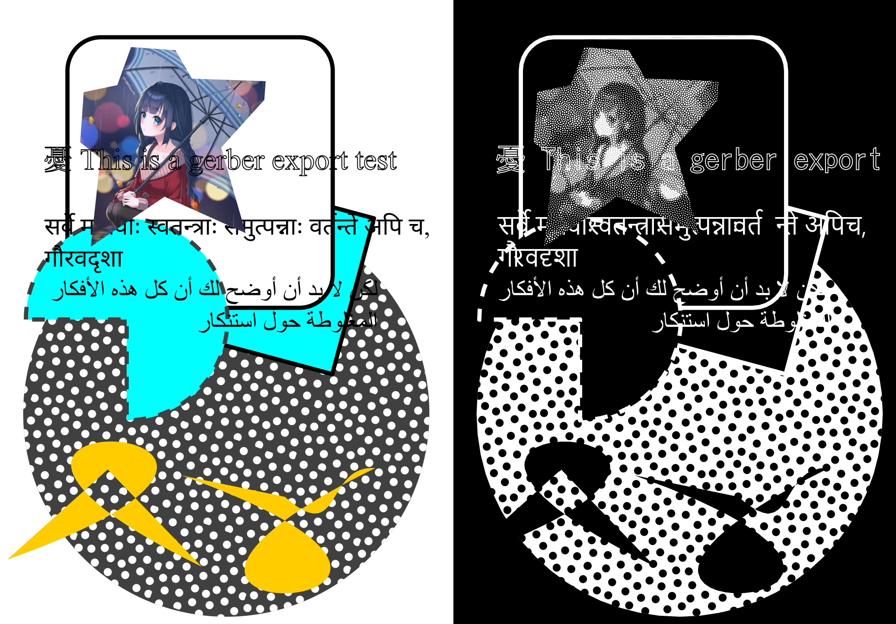

* Almost full SVG 1.1 static spec coverage (!)

  * Paths with beziers, self-intersections and holes
  * Strokes, even with dashes and markers
  * Pattern fills and strokes
  * Transformations and nested groups
  * Proper text rendering with support for complex text layout (e.g. Arabic)
  * <image> elements via either built-in vectorizer or built-in halftone processor
  * (some) CSS

* Writes Gerber, SVG or KiCAD S-Expression (``.kicad_mod``) formats
* Can export from top/bottom SVGs to a whole gerber layer stack at once with filename autodetection
* Can export SVGs to ``.kicad_mod`` files like svg2mod (but with full SVG support)
* Beziers flattening with configurable tolerance using actual math!
* Polygon intersection removal
* Polygon hole removal (!)
* Optionally vector-compositing of output: convert black/white/transparent image to black/transparent image
* Renders SVG templates from input gerbers for accurate and easy scaling and positioning of artwork
* layer masking with offset (e.g. all silk within 1mm of soldermask)
* Can read gerbers from zip files
* Limited SVG support for board outline layers (no fill/region support)
* Dashed lines supported on board outline layers

Gerbolyze is the end-to-end "paste this svg into these gerbers" command that handles all layers on both board sides at
once.  The heavy-duty computer geometry logic of gerbolyze is handled by the svg-flatten utility (``svg-flatten``
directory).  svg-flatten reads an SVG file and renders it into a variety of output formats. svg-flatten can be used like
a variant of the popular svg2mod that supports all of SVG and handles arbitrary input ``<path>`` elements.

Algorithm Overview
------------------

This is the algorithm gerbolyze uses to process a stack of gerbers.

* Map input files to semantic layers by their filenames
* For each layer:

  * load input gerber
  * Pass mask layers through ``gerbv`` for conversion to SVG
  * Pass mask layers SVG through ``svg-flatten --dilate``
  * Pass input SVG through ``svg-flatten --only-groups [layer]`` 
  * Overlay input gerber, mask and input svg
  * Write result to output gerber

This is the algorithm svg-flatten uses to process an SVG.

* pass input SVG through usvg_
* iterate depth-first through resulting SVG.

  * for groups: apply transforms and clip and recurse
  * for images: Vectorize using selected vectorizer
  * for paths:

    * flatten path using Cairo
    * remove self-intersections using Clipper
    * if stroke is set: process dash, then offset using Clipper
    * apply pattern fills
    * clip to clip-path
    * remove holes using Clipper

* for KiCAD S-Expression export: vector-composite results using CavalierContours: subtract each clear output primitive
  from all previous dark output primitives

Command-line usage
------------------

Generate SVG template from Gerber files:

.. code-block:: shell

    gerbolyze template [options] [-t|--top top_side_output.svg] [-b|--bottom ...] input_dir_or.zip

Render design from an SVG made with the template above into a set of gerber files:

.. code-block:: shell

    gerbolyze paste [options] [-t|--top top_side_design.svg] [-b|--bottom ...] [-o|--outline ...] input_dir_or.zip output_dir

Use svg-flatten to convert an SVG file into Gerber or flattened SVG:

.. code-block:: shell

    svg-flatten [options] --format [gerber|svg] [input_file.svg] [output_file]

Use svg-flatten to convert an SVG file into the given layer of a KiCAD S-Expression (``.kicad_mod``) file:

.. code-block:: shell

    svg-flatten [options] --format kicad --sexp-layer F.SilkS --sexp-mod-name My_Module [input_file.svg] [output_file]

Use svg-flatten to convert an SVG file into a ``.kicad_mod`` with SVG layers fed into separate KiCAD layers based on
their IDs like the popular ``svg2mod`` is doing:

Note:
    Right now, the input SVG's layers must have *ids* that match up KiCAD's s-exp layer names. Note that when you name
    a layer in Inkscape that only sets a ``name`` attribute, but does not change the ID. In order to change the ID in
    Inkscape, you have to use Inkscape's "object properties" context menu function.

    Also note that svg-flatten expects the layer names KiCAD uses in their S-Expression format. These are *different* to
    the layer names KiCAD exposes in the UI (even though most of them match up!).

    For your convenience, there is an SVG template with all the right layer names and IDs located next to this README.

.. code-block:: shell

    svg-flatten [options] --format kicad --sexp-mod-name My_Module [input_file.svg] [output_file]

``gerbolyze template``
~~~~~~~~~~~~~~~~~~~~~~

Usage: ``gerbolyze template [OPTIONS] INPUT``

Generate SVG template for gerbolyze paste from gerber files.

INPUT may be a gerber file, directory of gerber files or zip file with gerber files

Options:
********
``-t, --top top_layer.svg``
    Top layer output file.

``-b, --bottom bottom_layer.svg``
    Bottom layer output file. --top or --bottom may be given at once. If neither is given, autogenerate filenames.

``--vector | --raster``
    Embed preview renders into output file as SVG vector graphics instead of rendering them to PNG bitmaps. The
    resulting preview may slow down your SVG editor.

``--raster-dpi FLOAT``
    DPI for rastering preview

``--bbox TEXT``
    Output file bounding box. Format: "w,h" to force [w] mm by [h] mm output canvas OR "x,y,w,h" to force [w] mm by [h]
    mm output canvas with its bottom left corner at the given input gerber coördinates.

``gerbolyze paste``
~~~~~~~~~~~~~~~~~~~
(see `below <vectorization_>`__)

Usage: ``gerbolyze paste [OPTIONS] INPUT_GERBERS OUTPUT_GERBERS``

Render vector data and raster images from SVG file into gerbers. SVG input files are given with ``--top``, ``--bottom``
and ``--outline``. Note that for board outline layers, handling slightly differs from other layers as PCB fabs do not
support filled Gerber regions on these layers.

Options:
********

``-t, --top TEXT``
    Top side SVG overlay input file. At least one of this and ``--bottom`` should be given.

``-b, --bottom TEXT``
    Bottom side SVG overlay input file. At least one of this and ``--top`` should be given.

``-o, --outline TEXT``
    SVG file to be used for board outline layers. Can be the same file used for ``--top`` or ``--bottom``. Note that on
    board outline layers, SVG handling is slightly different since fabs don't support filled regions on these layers.
    See `below <outline_layers_>`_ for details.

``--layer-top``
    Top side SVG or PNG target layer. Default: Map SVG layers to Gerber layers, map PNG to Silk.

``--layer-bottom``
    Bottom side SVG or PNG target layer. See ``--layer-top``.

``--bbox TEXT``
    Output file bounding box. Format: "w,h" to force [w] mm by [h] mm output canvas OR "x,y,w,h" to force [w] mm by [h]
    mm output canvas with its bottom left corner at the given input gerber coördinates. This **must match the ``--bbox`` value given to
    template**!

``--subtract TEXT``
    Use user subtraction script from argument (see `below <subtraction_script_>`_)

``--no-subtract``
    Disable subtraction (see `below <subtraction_script_>`_)

``--dilate FLOAT``
    Default dilation for subtraction operations in mm (see `below <subtraction_script_>`_)

``--trace-space FLOAT``
    Passed through to svg-flatten, see `below <svg_flatten_>`__.

``--vectorizer TEXT``
    Passed through to svg-flatten, see `its description below <svg_flatten_>`__. Also have a look at `the examples below <vectorization_>`_.

``--vectorizer-map TEXT``
    Passed through to svg-flatten, see `below <svg_flatten_>`__.

``--exclude-groups TEXT``
    Passed through to svg-flatten, see `below <svg_flatten_>`__.

.. _outline_layers:

Outline layers
**************

Outline layers require special handling since PCB fabs do not support filled G36/G37 polygons on these layers. Gerbolyze
handles outline layers via the ``--outline [input.svg]`` option. This option tells it to add the input SVG's outline to
the outline gerber output layer. ``--outline`` expects the same SVG format that is also used for ``--top`` and
``--bottom``. Both templates contain an Inkscape layer for the outline, so you can use either template for the outline
layer as well. Since ``--outline`` will ignore all other layers, you can even put your outline into the same SVG as your
top or bottom side layers and pass that same file to both ``--top/--bottom`` and ``--outline``.

The main difference between normal layers and outline layers is how strokes are handled. On outline layers, strokes are
translated to normal Gerber draw commands (D01, D02 etc.) with an aperture set to the stroke's width instead of tracing
them to G36/G37 filled regions. This means that on outline layers, SVG end caps and line join types do not work: All
lines are redered with round joins and end caps.

One exception from this are patterns, which work as expected for both fills and strokes with full support for joins and
end caps.

Dashed strokes are supported on outline layers and can be used to make easy mouse bites.

.. _subtraction_script:

Subtraction scripts
*******************

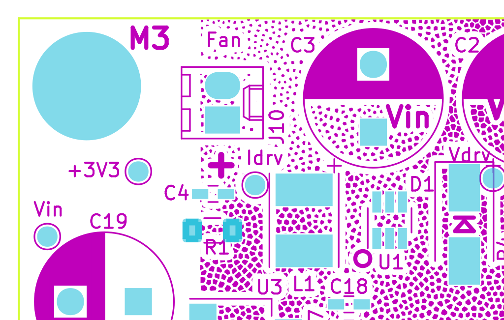

Subtraction scripts tell ``gerbolyze paste`` to remove an area around certain input layers to from an overlay layer.
When a input layer is given in the subtraction script, gerbolyze will dilate (extend outwards) everything on this input
layer and remove it from the target overlay layer. By default, Gerbolyze subtracts the mask layer from the silk layer to
make sure there are no silk primitives that overlap bare copper, and subtracts each input layer from its corresponding
overlay to make sure the two do not overlap. In the picture above you can see both at work: The overlay contains
halftone primitives all over the place. The subtraction script has cut out an area around all pads (mask layer) and all
existing silkscreen. You can turn off this behavior by passing ``--no-subtract`` or pass your own "script".

The syntax of these scripts is:

.. code-block::

    {target layer} -= {source layer} {dilation} [; ...]

The target layer must be ``out.{layer name}`` and the source layer ``in.{layer name}``. The layer names are gerbolyze's
internal layer names, i.e.: ``paste, silk, mask, copper, outline, drill``

The dilation value is optional, but can be a float with a leading ``+`` or ``-``. If given, before subtraction the
source layer's features will be extended by that many mm. If not given, the dilation defaults to the value given by
``--dilate`` if given or 0.1 mm otherwise. To disable dilation, simply pass ``+0`` here.

Multiple commands can be separated by semicolons ``;`` or line breaks.

The default subtraction script is:

.. code-block::

    out.silk -= in.mask
    out.silk -= in.silk+0.5
    out.mask -= in.mask+0.5
    out.copper -= in.copper+0.5

``gerbolyze vectorize``
~~~~~~~~~~~~~~~~~~~~~~~

``gerbolyze vectorize`` is a wrapper provided for compatibility with Gerbolyze version 1. It does nothing more than
internally call ``gerbolyze paste`` with some default arguments set.

.. _svg_flatten:

``svg-flatten``
~~~~~~~~~~~~~~~

Usage: ``svg-flatten [OPTIONS]... [INPUT_FILE] [OUTPUT_FILE]``

Specify ``-`` for stdin/stdout.

Options:
********

``-h, --help``
    Print help and exit

``-v, --version``
    Print version and exit

``-o, --format``
    Output format. Supported: gerber, gerber-outline (for board outline layers), svg, s-exp (KiCAD S-Expression)

``-p, --precision``
    Number of decimal places use for exported coordinates (gerber: 1-9, SVG: >=0). Note that not all gerber viewers are
    happy with too many digits. 5 or 6 is a reasonable choice.

``--clear-color``
    SVG color to use in SVG output for "clear" areas (default: white)

``--dark-color``
    SVG color to use in SVG output for "dark" areas (default: black)

``-f, --flip-gerber-polarity``
    Flip polarity of all output gerber primitives for --format gerber.

``-d, --trace-space``
    Minimum feature size of elements in vectorized graphics (trace/space) in mm. Default: 0.1mm.

``--no-header``
    Do not export output format header/footer, only export the primitives themselves

``--flatten``
    Flatten output so it only consists of non-overlapping white polygons. This perform composition at the vector level.
    Potentially slow. This defaults to on when using KiCAD S-Exp export because KiCAD does not know polarity or colors.

``--no-flatten``
    Disable automatic flattening for KiCAD S-Exp export

``--dilate``
    Dilate output gerber primitives by this amount in mm. Used for masking out other layers.

``-g, --only-groups``
    Comma-separated list of group IDs to export.

``-b, --vectorizer``
    Vectorizer to use for bitmap images. One of poisson-disc (default), hex-grid, square-grid, binary-contours,
    dev-null. Have a look at `the examples below <vectorization_>`_.

``--vectorizer-map``
    Map from image element id to vectorizer. Overrides --vectorizer.  Format: id1=vectorizer,id2=vectorizer,...

    You can use this to set a certain vectorizer for specific images, e.g. if you want to use both halftone
    vectorization and contour tracing in the same SVG. Note that you can set an ``<image>`` element's SVG ID from within
    Inkscape though the context menu's Object Properties tool.

``--force-svg``
    Force SVG input irrespective of file name

``--force-png``
    Force bitmap graphics input irrespective of file name

``-s, --size``
    Bitmap mode only: Physical size of output image in mm. Format: 12.34x56.78

``--sexp-mod-name``
    Module name for KiCAD S-Exp output. This is a mandatory argument if using S-Exp output.

``--sexp-layer``
    Layer for KiCAD S-Exp output. Defaults to auto-detect layers from SVG layer/top-level group IDs. If given, SVG
    groups and layers are completely ignored and everything is simply vectorized into this layer, though you cna still
    use ``-g`` for group selection.

``-a, --preserve-aspect-ratio``
    Bitmap mode only: Preserve aspect ratio of image. Allowed values are meet, slice. Can also parse full SVG
    preserveAspectRatio syntax.

``--no-usvg``
    Do not preprocess input using usvg (do not use unless you know *exactly* what you're doing)

``--usvg-dpi``
    Passed through to usvg's --dpi, in case the input file has different ideas of DPI than usvg has.

``--scale``
    Scale input svg lengths by this factor.

``-e, --exclude-groups``
    Comma-separated list of group IDs to exclude from export. Takes precedence over --only-groups.

.. _vectorization:

Gerbolyze image vectorization
-----------------------------

Gerbolyze has two built-in strategies to translate pixel images into vector images. One is its built-in halftone
processor that tries to approximate grayscale. The other is its built-in binary vectorizer that traces contours in
black-and-white images. Below are examples for the four options.

The vectorizers can be used in isolation through ``svg-flatten`` with either an SVG input that contains an image or a
PNG/JPG input.

The vectorizer can be controlled globally using the ``--vectorizer`` flag in both ``gerbolyze`` and ``svg-flatten``. It
can also be set on a per-image basis in both using ``--vectorizer-map [image svg id]=[option]["," ...]``.

.. for f in vec_*.png; convert -background white -gravity center $f -resize 500x500 -extent 500x500 (basename -s .png $f)-square.png; end
.. for vec in hexgrid square poisson contours; convert vec_"$vec"_whole-square.png vec_"$vec"_detail-square.png -background transparent -splice 25x0+0+0 +append -chop 25x0+0+0 vec_"$vec"_composited.png; end

``--vectorizer poisson-disc`` (the default) 
~~~~~~~~~~~~~~~~~~~~~~~~~~~~~~~~~~~~~~~~~~~

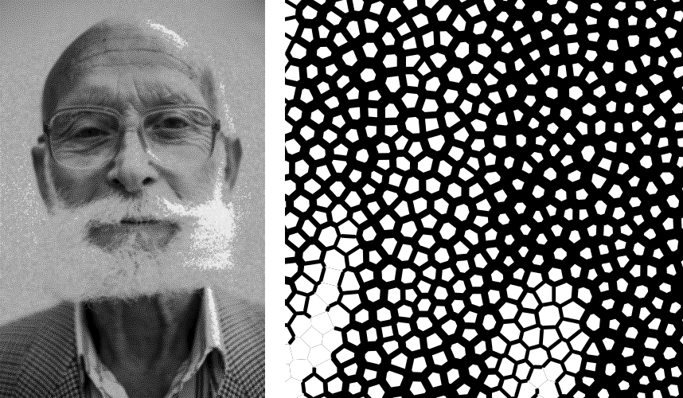

``--vectorizer hex-grid``
~~~~~~~~~~~~~~~~~~~~~~~~~

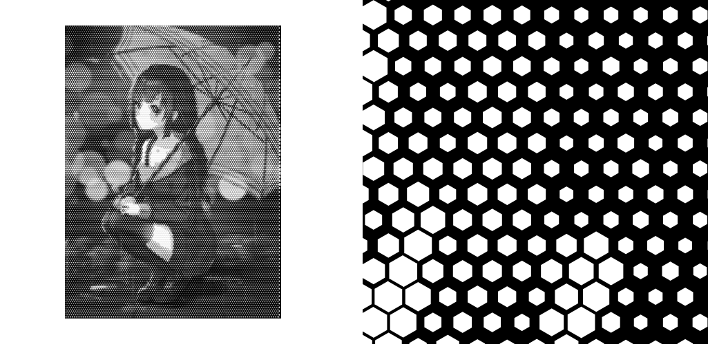

``--vectorizer square-grid``
~~~~~~~~~~~~~~~~~~~~~~~~~~~~

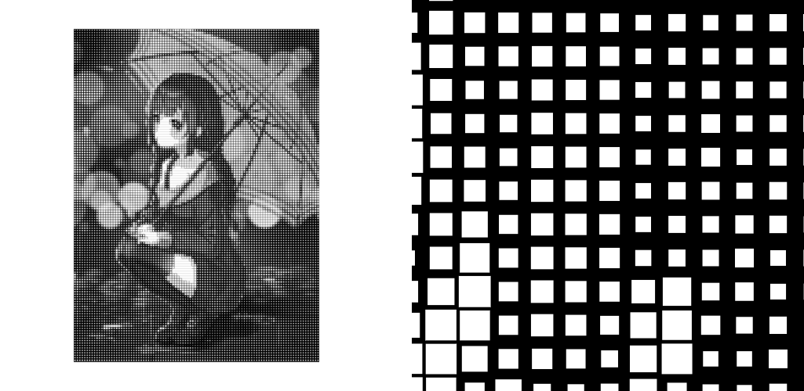

``--vectorizer binary-contours``
~~~~~~~~~~~~~~~~~~~~~~~~~~~~~~~~

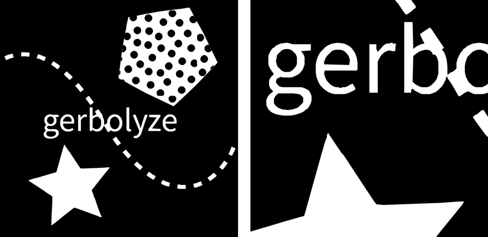

The binary contours vectorizer requires a black-and-white binary input image. As you can see, like every bitmap tracer
it will produce some artifacts. For artistic input this is usually not too bad as long as the input data is
high-resolution. Antialiased edges in the input image are not only OK, they may even help with an accurate
vectorization.

GIMP halftone preprocessing guide
---------------------------------

Gerbolyze has its own built-in halftone processor, but you can also use the high-quality "newsprint" filter built into
GIMP_ instead if you like. This section will guide you through this. The PNG you get out of this can then be fed into
gerbolyze using ``--vectorizer binary-contours``.

1 Import your desired artwork
~~~~~~~~~~~~~~~~~~~~~~~~~~~~~

Though anime or manga pictures are highly recommended, you can use any image including photographs. Be careful to select
a picture with comparatively low detail that remains recognizable at very low resolution. While working on a screen this
is hard to vizualize, but the grain resulting from the low resolution of a PCB's silkscreen is quite coarse.

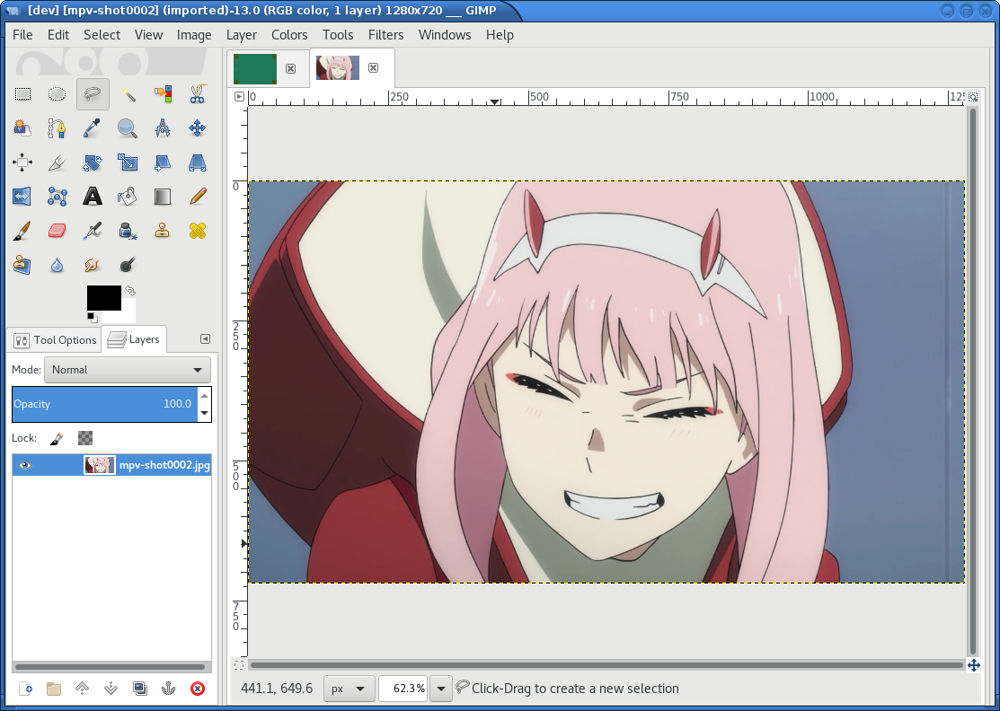

2 Convert the image to grayscale
~~~~~~~~~~~~~~~~~~~~~~~~~~~~~~~~

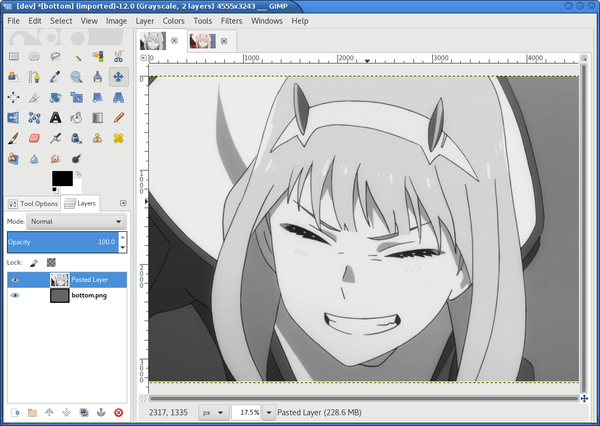

3 Fine-tune the image's contrast
~~~~~~~~~~~~~~~~~~~~~~~~~~~~~~~~

To look well on the PCB, contrast is critical. If your source image is in color, you may have lost some contrast during
grayscale conversion. Now is the time to retouch that using the GIMP's color curve tool.

When using the GIMP's newsprint filter, bright grays close to white and dark grays close to black will cause very small
dots that might be beyond your PCB manufacturer's maximum resolution. To control this case, add small steps at the ends
of the grayscale value curve as shown (exaggerated) in the picture below. These steps saturate very bright grays to
white and very dark grays to black while preserving the values in the middle.

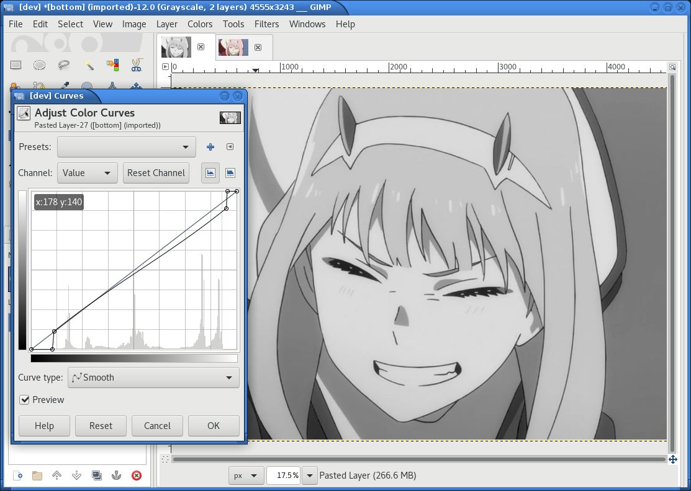

4 Retouch details
~~~~~~~~~~~~~~~~~

Therer might be small details that don't look right yet, such as the image's background color or small highlights that
merge into the background now. You can manually change the color of any detail now using the GIMP's flood-fill tool.

If you don't want the image's background to show up on the final PCB at all, just make it black.

Particularly on low-resolution source images it may make sense to apply a blur with a radius similar to the following
newsprint filter's cell size (10px) to smooth out the dot pattern generated by the newsprint filter.

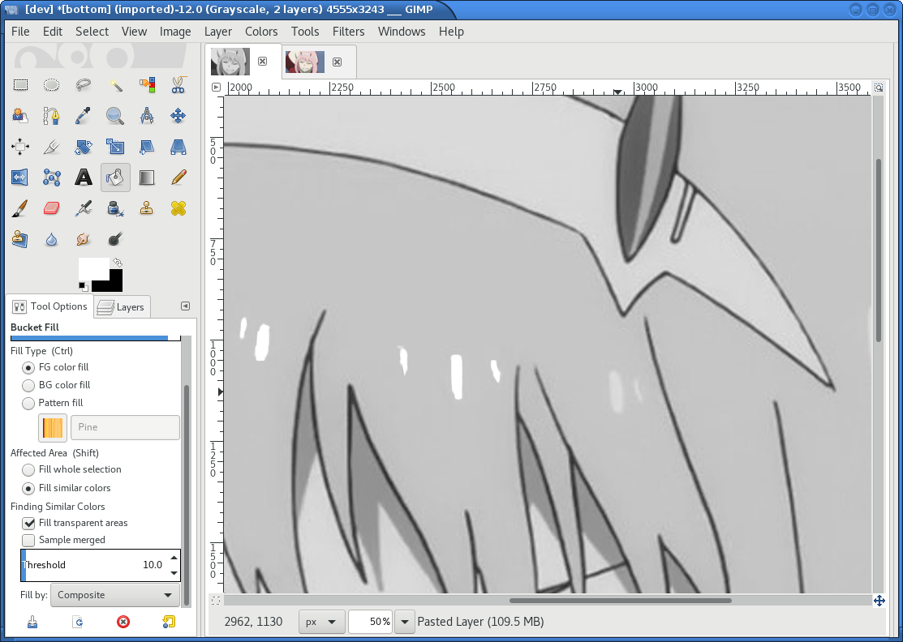

In the following example, I retouched the highlights in the hair of the character in the picture to make them completely
white instead of light-gray, so they still stand out nicely in the finished picture.

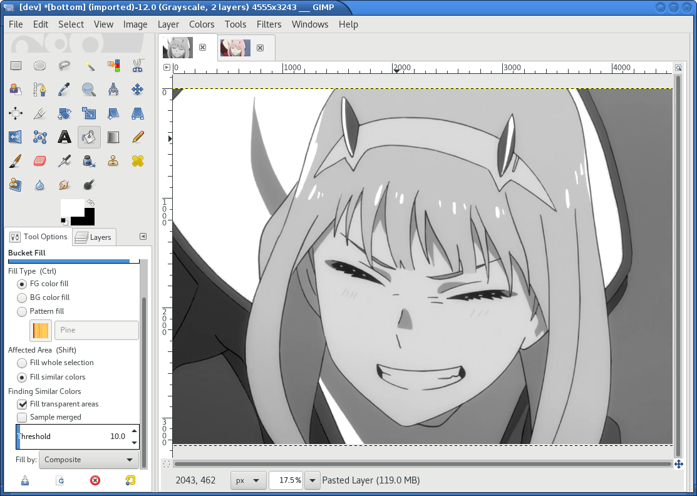

5 Run the newsprint filter
~~~~~~~~~~~~~~~~~~~~~~~~~~

Now, run the GIMP's newsprint filter, under filters, distorts, newsprint.

The first important settings is the spot size, which should be larger than your PCB's minimum detail size (about 10px
with ``gerbolyze render`` default settings for good-quality silkscreen). In general the cheap and fast standard option of chinese PCB houses will require a larger detail size, but when you order specialty options like large size, 4-layer or non-green color along with a longer turnaround time you'll get much better-quality silk screen.

The second important setting is oversampling, which should be set to four or slightly higher. This improves the result
of the edge reconstruction of ``gerbolyze vectorize``.

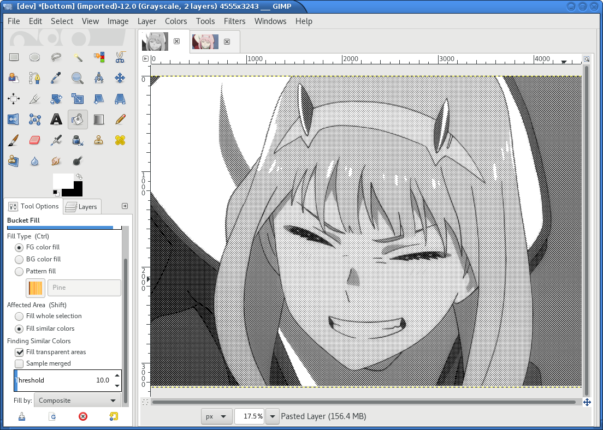

The following are examples on the detail resulting from the newsprint filter.

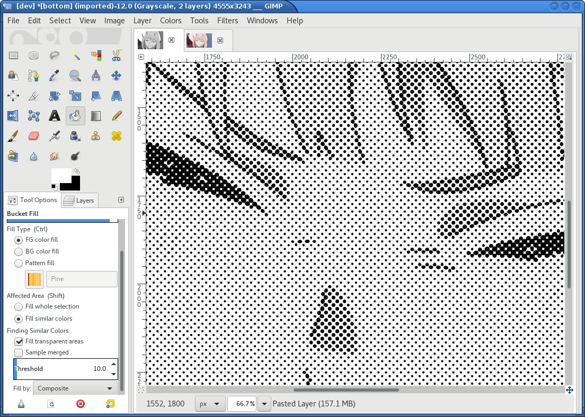

6 Export the image for use with ``gerbolyze vectorize``
~~~~~~~~~~~~~~~~~~~~~~~~~~~~~~~~~~~~~~~~~~~~~~~~~~~~~~~

Simply export the image as a PNG file. Below are some pictures of the output ``gerbolyze vectorize`` produced for this
example.

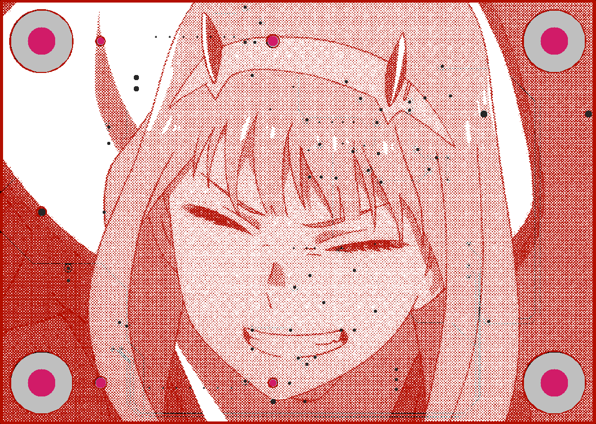

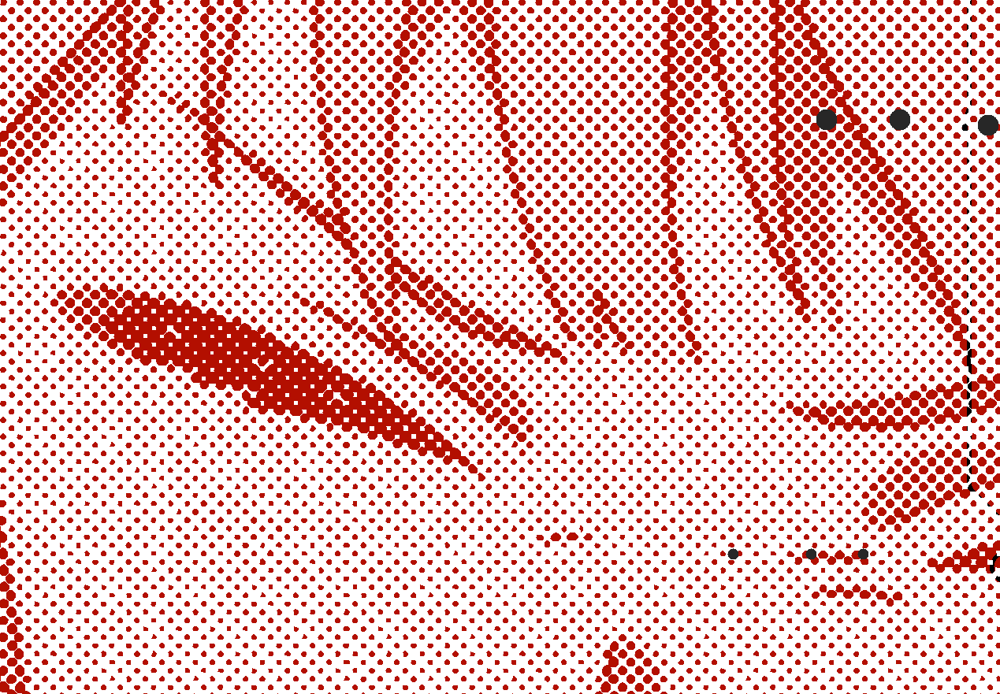

Manufacturing Considerations
----------------------------

The main consideration when designing artwork for PCB processes is the processes' trace/space design rule. The two
things you can do here is one, to be creative with graphical parts of the design and avoid extremely narrow lines,
wedges or other thin features that will not come out well. Number two is to keep detail in raster images several times
larger than the manufacturing processes native capability. For example, to target a trace/space design rule of 100 µm,
the smallest detail in embedded raster graphics should not be much below 1mm.

Gerbolyze's halftone vectorizers have built-in support for trace/space design rules. While they can still produce small
artifacts that violate these rules, their output should be close enough to satifsy board houses and close enough for the
result to look good. The way gerbolyze does this is to clip the halftone cell's values to zero whenevery they get too
small, and to forcefully split or merge two neighboring cells when they get too close. While this process introduces
slight steps at the top and bottom of grayscale response, for most inputs these are not noticeable.

On the other hand, for SVG vector elements as well as for traced raster images, Gerbolyze cannot help with these design
rules. There is no heuristic that would allow Gerbolyze to non-destructively "fix" a design here, so all that's on the
roadmap here is to eventually include a gerber-level design rule checker.

As far as board houses go, I have made good experiences with the popular Chinese board houses. In my experience, JLC
will just produce whatever you send them with little fucks being given about design rule adherence or validity of the
input gerbers. This is great if you just want artistic circuit boards without much of a hassle, and you don't care if
they come out exactly as you imagined. The worst I've had happen was when an older version of gerbolyze generated
polygons with holes assuming standard fill-rule processing. The in the board house's online gerber viewer things looked
fine, and neither did they complain during file review. However, the resulting boards looked completely wrong because
all the dark halftones were missing.

PCBWay on the other hand has a much more rigurous file review process. They <em>will</em> complain when you throw
illegal garbage gerbers at them, and they will helpfully guide you through your design rule violations. In this way you
get much more of a professional service from them and for designs that have to be functional their higher level of
scrutiny definitely is a good thing. For the design you saw in the first picture in this article, I ended up begging
them to just plot my files if it doesn't physically break their machines and to their credit, while they seemed unhappy
about it they did it and the result looks absolutely stunning.

PCBWay is a bit more expensive on their lowest-end offering than JLC, but I found that for anything else (large boards,
multi-layer, gold plating etc.) their prices match. PCBWay offers a much broader range of manufacturing options such as
flexible circuit boards, multi-layer boards, thick or thin substrates and high-temperature substrates.

When in doubt about how your design is going to come out on the board, do not hesitate to contact your board house. Most
of the end customer-facing online PCB services have a number of different factories that do a number of different
fabrication processes for them depending on order parameters. Places like PCBWay have exceptional quality control and
good customer service, but that is mostly focused on the technical aspects of the PCB. If you rely on visual aspects
like silkscreen uniformity or solder mask color that is a strong no concern to everyone else in the electronics
industry, you may find significant variations between manufacturers or even between orders with the same manufacturer
and you may encounter challenges communicating your requirements.

Limitations
-----------

SVG raster features
~~~~~~~~~~~~~~~~~~~

Currently, SVG masks and filters are not supported. Though SVG is marketed as a "vector graphics format", these two
features are really raster primitives that all SVG viewers perform at the pixel level after rasterization. Since
supporting these would likely not end up looking like what you want, it is not a planned feature. If you need masks or
filters, simply export the relevant parts of the SVG as a PNG then include that in your template.

Gerber pass-through
~~~~~~~~~~~~~~~~~~~

Since gerbolyze has to composite your input gerbers with its own output, it has to fully parse and re-serialize them.
gerbolyze uses pcb-tools_ and pcb-tools-extension_ for all its gerber parsing needs. Both seem well-written, but likely
not free of bugs. This means that in rare cases information may get lost during this round trip. Thus, *always* check
the output files for errors before submitting them to production.

Gerbolyze is provided without any warranty, but still please open an issue or `send me an email
<mailto:gerbolyze@jaseg.de>`__ if you find any errors or inconsistencies. 

Trace/Space design rule adherence
~~~~~~~~~~~~~~~~~~~~~~~~~~~~~~~~~

While the grayscale halftone vectorizers do a reasonable job adhering to a given trace/space design rule, they can still
produce small parts of output that violate it. For the contour vectorizer as well as for all SVG primitives, you are
responsible for adhering to design rules yourself as there is no algorithm that gerboyze could use to "fix" its input.

A design rule checker is planned as a future addition to gerbolyze, but is not yet part of it. If in doubt, talk to your
fab and consider doing a test run of your design before ordering assembled boards ;)

Gallery
-------

.. image:: pics/sample3.jpg
  :width: 400px

Licensing
---------

This tool is licensed under the rather radical AGPLv3 license. Briefly, this means that you have to provide users of a
webapp using this tool in the backend with this tool's source.

I get that some people have issues with the AGPL. In case this license prevents you from using this software, please
send me `an email <mailto:agpl.sucks@jaseg.de>`__ and I can grant you an exception. I want this software to be useful to as
many people as possible and I wouldn't want the license to be a hurdle to anyone. OTOH I see a danger of some cheap
board house just integrating a fork into their webpage without providing their changes back upstream, and I want to
avoid that so the default license is still AGPL.

.. _usvg: https://github.com/RazrFalcon/resvg
.. _Inkscape: https://inkscape.org/
.. _pcb-tools: https://github.com/curtacircuitos/pcb-tools
.. _pcb-tools-extension: https://github.com/opiopan/pcb-tools-extension
.. _GIMP: https://gimp.org/
